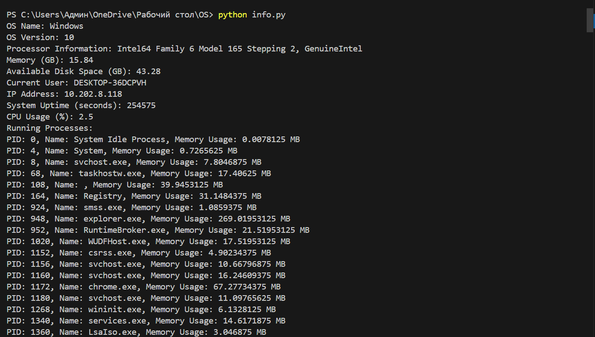

# OS Parameters Retrieval Program
## Baurzhan Saliyev SE-2204
This Python program retrieves essential parameters of the operating system using system calls and external libraries such as `psutil`.
Instruction:
1. Open CMD
2. Clone from github:
```
git clone github.com/VsProger/osinfo
```
3. Go to the folder where the repo is stored.
4. Install all neccessary libraries:
```
pip install psutil
```
5. Run:
```
python info.py
```
6. Get the result:
<br>


